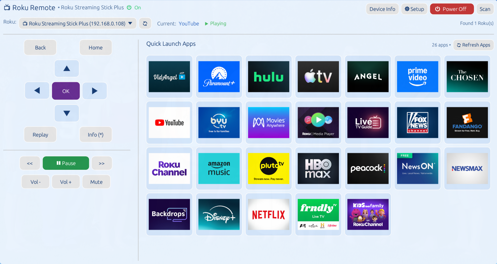
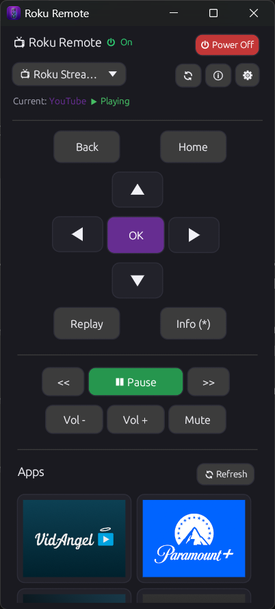

# 📺 Roku Remote (Rust)

A modern, fast, lightweight, and cross-platform native desktop remote control for Roku streaming sticks and Smart TVs. Written in **Rust** using **egui / eframe**.



---

## ✨ Features

- **Multi-Device Discovery & Selector**: Automatically discovers all Roku devices on your local Wi-Fi / LAN via SSDP UDP multicast and parallel multi-threaded subnet probes. Includes an interactive dropdown selector to switch between multiple Rokus across different rooms, as well as a manual IP entry mode.
- **In-App Setup Guide & Permission Alerts**: Built-in interactive setup guide modal (`⚙ Setup`) and automatic warning banners if a Roku's Mobile App Control is in "Limited" mode, providing step-by-step instructions to enable network control.
- **Full Navigation D-Pad**: Vector-rendered arrow keys (`▲`, `▼`, `◄`, `►`), `OK / Select`, `Home`, `Back`, `Instant Replay`, and `Options / Info (*)`.
- **Media & Volume Control**: Dedicated playback row (`<<`, `Play / Pause`, `>>`), `Volume Up`, `Volume Down`, and `Mute`.
- **Live Playback State & Dynamic Play/Pause Button**: Real-time status indicator (`▶ Playing`, `⏸ Paused`, `⏳ Buffering`) paired with a context-aware Play/Pause button that dynamically changes label and color (green for playing, amber for paused).
- **Power State Indicator & Instant Power Toggle**:
  - Live status indicator with crisp vector computer power symbol (green for On, red for Off).
  - High-visibility action button (`Power Off` in red / `Power On` in green) with vector power icon and multi-stage verification against Roku's `/query/device-info` endpoint.
- **True Sleep State & Zero Idle Overhead**:
  - Automatically enters deep sleep mode when minimized (instant), unfocused (3s), or idle (10s), stopping all background network queries and file polling (0% CPU, 0 network requests).
  - Wakes up instantly on user interaction and updates status.
- **Quick Launch Apps with High-Res Channel Icons**:
  - Automatically queries all installed channels on the Roku device.
  - Full-bleed app cards displaying high-res icons (supports both PNG and JPEG formats, including Netflix, Prime Video, YouTube, Disney+, Hulu, HBO Max, etc.).
  - Seamless fallback to channel names if an icon is not available.
- **Offline & Instant Startup Icon Caching**:
  - Channel list and decoded icons are cached locally (`~/.cache/roku-remote-rs/icons/`), enabling instant rendering on startup without waiting for network queries.
  - Dedicated **`🔄 Refresh Apps`** button (and shortcut) to rescan and update installed channels anytime.
- **Adaptive Responsive Layout**:
  - Automatically transitions between a two-column wide view and a compact single-column view based on window width.
- **Full Keyboard Control & Shortcut Cheat Sheet**:
  - Direct keyboard control for navigation, volume, playback, and app refresh.
  - Built-in shortcuts cheat sheet modal (`Ctrl + ,` or `Esc` to close).
- **Omarchy / System Desktop Theme Integration**:
  - Automatically detects and matches Omarchy system themes (`colors.toml`) with live hot-reloading.
- **Device Details Modal**:
  - Inspect model name, model number, software version, Wi-Fi network, UI resolution, power mode, IP address, and live/sleeping App Status.
- **Modular & Idiomatic Rust Architecture**:
  - Refactored into clean modules (`app`, `models`, `roku::client`, `roku::parser`, `theme`) with 100% unit test coverage for XML parsers and color utilities.

---

## 📱 Responsive Adaptive Layout

Roku Remote dynamically detects window width and automatically reflows its user interface:

* **Wide Screen Mode (window width ≥ 680px)**: 
  Splits into two side-by-side columns. Remote navigation and media playback controls remain pinned on the left (`300px`), while the full grid of quick-launch channel cards expands across the right side.
* **Compact / Narrow Window Mode (window width < 680px)**: 
  Automatically transitions into a single-column, vertically scrollable layout. This mode is designed for tiling window managers (such as Hyprland, Sway, or i3), side panels, or snapping the remote beside another active window.

<p align="center">
  
  <br/>
  <em>Automatic single-column reflow when window is resized below 680px</em>
</p>

---

## ⌨️ Keyboard Shortcuts

| Shortcut | Action | Description |
| :--- | :--- | :--- |
| **Arrow Keys** | Navigation | Move Up, Down, Left, Right |
| **Enter** / **Space** | OK / Select | Activate selected item |
| **Backspace** / **Esc** | Back | Back / Return button |
| **H** | Home | Return to Roku Home screen |
| **P** | Play / Pause | Toggle media playback |
| **R** | Replay | Instant replay (jumps back ~10s) |
| **I** | Info / Options | Options / Asterisk (`*`) menu |
| **Ctrl + Up / Down** | Volume | Volume Up / Volume Down |
| **Ctrl + Left / Right** | Seek | Fast Forward (`>>`) / Rewind (`<<`) |
| **Ctrl + M** | Mute | Toggle audio mute |
| **Ctrl + Shift + R** or **Ctrl + A** | Refresh Apps | Check and reload installed apps & icons |
| **Ctrl + ,** | Cheat Sheet | Toggle keyboard shortcuts modal |

---

## ⚠️ Important: Roku Device Setup & Network Permissions

For this remote control (or any external app) to communicate with your Roku device over your local Wi-Fi, you **must ensure external control permissions are enabled** on your Roku:

1. Turn on your Roku device / TV.
2. Go to **Settings** → **System** → **Advanced system settings**.
3. Select **Control by mobile apps** → **Network access**.
4. Set it to **Default** or **Permissive** (do **not** leave it on *Disabled*).
5. Ensure your computer and your Roku device are connected to the **same local Wi-Fi / LAN network**.

> **Note:** Roku devices communicate via HTTP and SSDP over port `8060`. If the network access setting is Disabled, the Roku will block button presses and app launch requests.

---

## 🛠️ Prerequisites

You need a working Rust toolchain (version 1.75+ recommended):

```bash
curl --proto '=https' --tlsv1.2 -sSf https://sh.rustup.rs | sh
```

### Linux Build Dependencies
On Arch Linux / Omarchy:
```bash
sudo pacman -S base-devel pkg-config openssl
```

On Ubuntu / Debian:
```bash
sudo apt update
sudo apt install build-essential pkg-config libssl-dev libx11-dev libxkbcommon-dev libwayland-dev
```

---

## 🚀 Easy Installation Scripts

Automated compile-and-install scripts are provided in the `scripts/` directory for each operating system:

### 🐧 Linux
Compiles the optimized release binary, installs it to `~/.local/bin/roku-remote-rs`, and registers the `.desktop` menu launcher:
```bash
chmod +x scripts/install-linux.sh
./scripts/install-linux.sh
```

### 🍏 macOS
Compiles the release binary, creates a native `Roku Remote.app` bundle in `~/Applications` with High-DPI support, and adds the command-line binary to `~/.local/bin`:
```bash
chmod +x scripts/install-macos.sh
./scripts/install-macos.sh
```

### 🪟 Windows
Compiles `roku-remote-rs.exe`, installs it to `%LOCALAPPDATA%\Programs\RokuRemote`, adds it to the user's `PATH`, and creates a Start Menu shortcut:
```powershell
powershell -ExecutionPolicy Bypass -File .\scripts\install-windows.ps1
```

---

## 🔨 Manual Building & Testing

### 1. Run Tests
```bash
cargo test
```

### 2. Run in Development Mode
```bash
cargo run
```

### 3. Build Release Binary
```bash
cargo build --release
```
The optimized executable will be located at `target/release/roku-remote-rs`.

---

## 🏗️ Cross-Compiling from Omarchy Linux

On **Omarchy Linux** (Arch Linux-based), you can easily cross-compile release binaries for **Windows** and **macOS** using native toolchains or cargo-cross.

### 🪟 Cross-Compiling for Windows (`x86_64-pc-windows-gnu`)

Omarchy provides the MinGW-w64 toolchain in the official Arch repositories:

1. **Install MinGW cross-compiler and Windows Rust target**:
   ```bash
   sudo pacman -S mingw-w64-gcc
   rustup target add x86_64-pc-windows-gnu
   ```

2. **Configure Cargo linker for MinGW**:
   Add the linker to your project or global cargo config (`~/.cargo/config.toml`):
   ```toml
   [target.x86_64-pc-windows-gnu]
   linker = "x86_64-w64-mingw32-gcc"
   ar = "x86_64-w64-mingw32-ar"
   ```

3. **Build the Windows executable**:
   ```bash
   cargo build --target x86_64-pc-windows-gnu --release
   ```
   The compiled `.exe` will be located at:
   ```bash
   target/x86_64-pc-windows-gnu/release/roku-remote-rs.exe
   ```

---

### 🍏 Cross-Compiling for macOS (Apple Silicon & Intel)

Because macOS builds require Apple SDK frameworks, the cleanest method on Linux is using [`cross`](https://github.com/cross-rs/cross) (which uses containerized environments via Podman or Docker):

1. **Install Podman (or Docker) and `cross`**:
   ```bash
   sudo pacman -S podman
   cargo install cross --git https://github.com/cross-rs/cross
   ```

2. **Build for Apple Silicon (M1/M2/M3/M4)**:
   ```bash
   cross build --target aarch64-apple-darwin --release
   ```

3. **Build for Intel Mac**:
   ```bash
   cross build --target x86_64-apple-darwin --release
   ```
   The resulting binary will be in `target/aarch64-apple-darwin/release/roku-remote-rs` and can be placed directly into `Roku Remote.app/Contents/MacOS/`.

---

### ⚡ Using `cross` for Zero-Setup Multi-Platform Builds

If you prefer not to install individual host C cross-compilers on Omarchy:
```bash
cargo install cross --git https://github.com/cross-rs/cross

# Build for Windows:
cross build --target x86_64-pc-windows-gnu --release

# Build for Linux musl (portable static binary):
cross build --target x86_64-unknown-linux-musl --release
```

---

## 📄 License

MIT or Apache-2.0.
